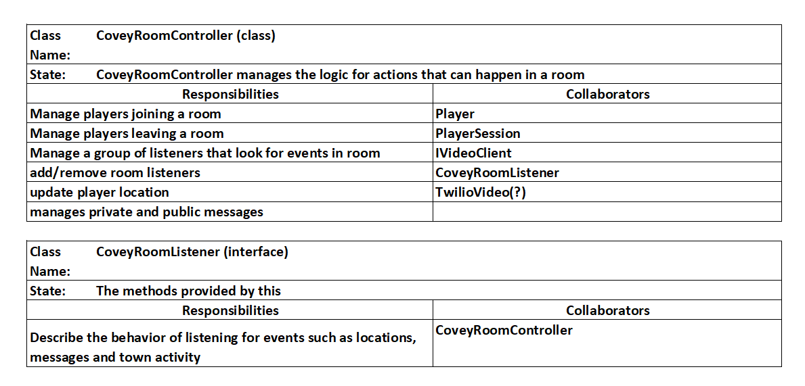
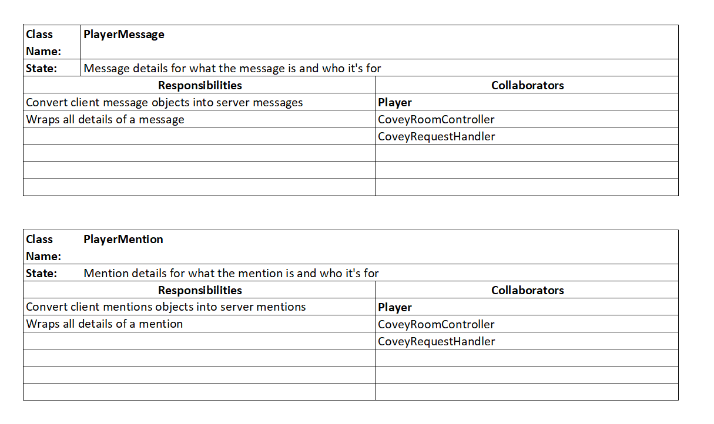

# Design Decisions

## Backend

### Choice 1 - Changed Listeners from Array to Map

- Enables constant time access on specific listeners
- Enables access to specific listeners based on player id to emit specific events (i.e. private
  messages)

### Choice 2 - Using socket handling for messaging

- Messages need to be sent and received between the client and server in real time in order to
  prevent any lag that would be caused from a rest endpoint with interval refreshes

-

## Frontend

### Choice 1 - ChatView and ChatBox

- ChatView is the parent of chat box will keep up with whether the chat box has space on the view
  port and creates an open/close icon if it doesn't

### Choice 2 - Modifications to CoveyAppState

- Messages persist across the entire app state for easy access
- Message colors must globally persist in the CoveyAppState since ChatBox will rerender from changes
  like viewport size adjustments

### Choice 3 - Local state in ChatBox

- Message text, mentions and recipients are maintained locally until the message is sent

### Choice 4 - react-mentions npm library added

- Added to reduce boilerplate for detection of "@" identifier in text input to identify a mention

## New Backend CRC Cards

### Modifications

### Additions

